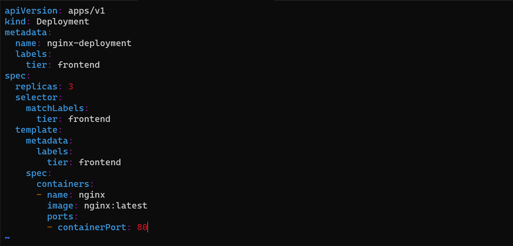
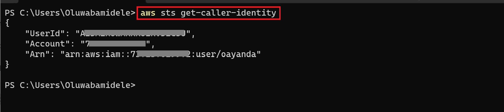
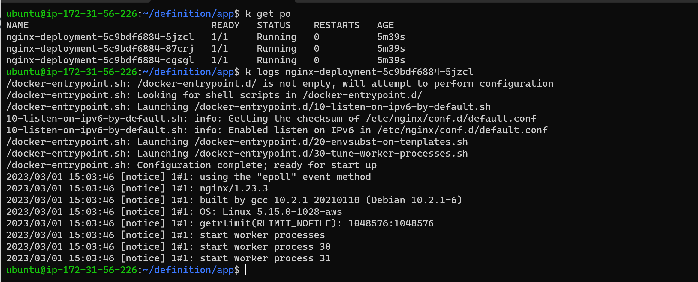
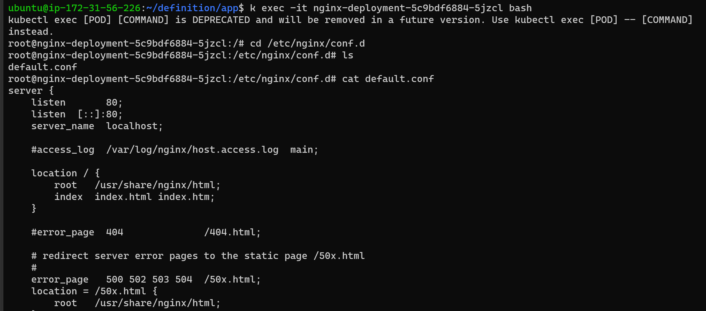
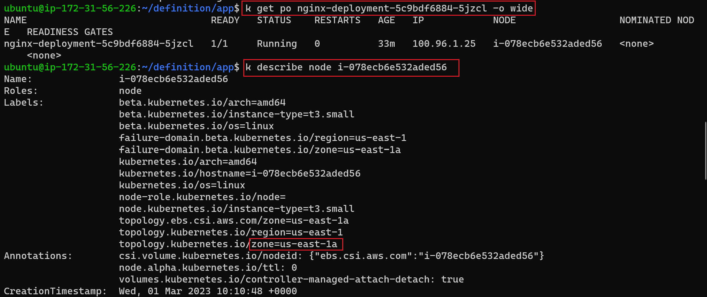
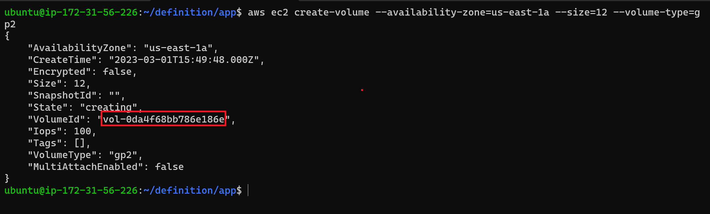
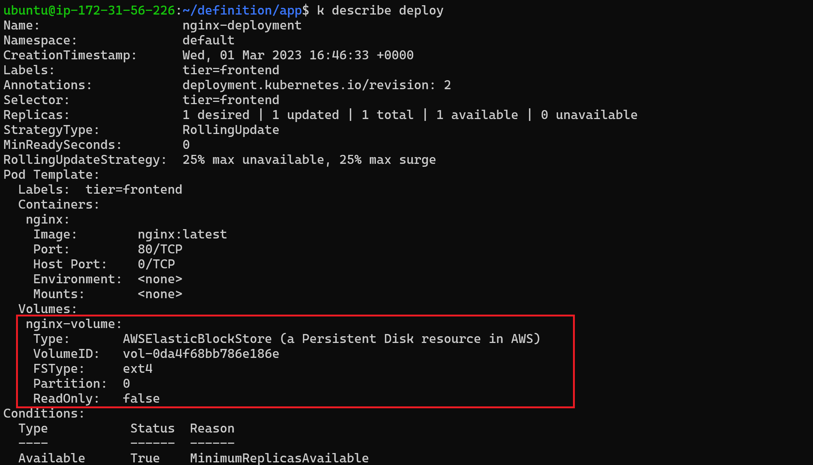
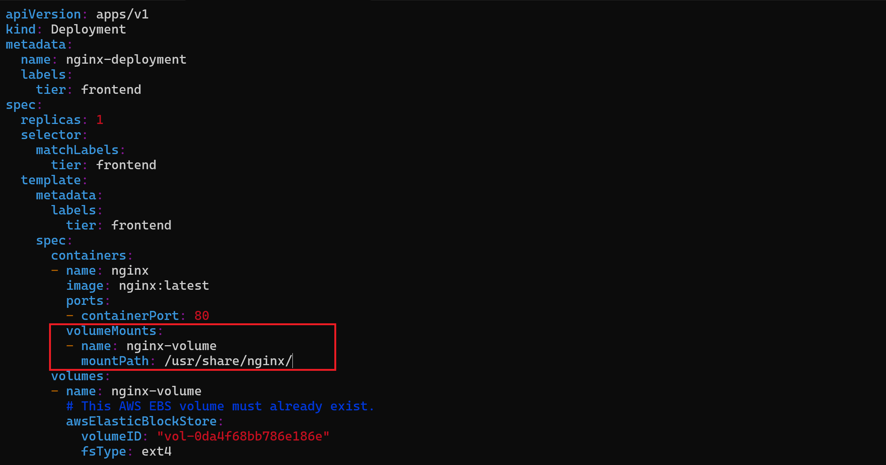

# Persisting Data in Kubernetes 

By the default the pods are ephemeral, meaning it can dead at anytime and when it does, all information deads with the pod. 

## emptyDir
An emptyDir volume is first created when a Pod is assigned to a node, and exists as long as that Pod is running on that node. As the name says, the emptyDir volume is initially empty. All containers in the Pod can read and write the same files in the emptyDir volume, though that volume can be mounted at the same or different paths in each container. When a Pod is removed from a node for any reason, the data in the emptyDir is deleted permanently.

```bash
apiVersion: v1
kind: Pod
metadata:
  name: test-pd
spec:
  containers:
  - image: registry.k8s.io/test-webserver
    name: test-container
    volumeMounts:
    - mountPath: /cache
      name: cache-volume
  volumes:
  - name: cache-volume
    emptyDir:
      sizeLimit: 500Mi
```
## Configure awsElasticBlockStore for Persisant Storage

An awsElasticBlockStore volume mounts an Amazon Web Services (AWS) EBS volume into your pod. The contents of an EBS volume are persisted and the volume is only unmmounted when the pod crashes, or terminates. This means that an EBS volume can be pre-populated with data, and that data can be shared between pods.

Before you create a persistant volume, lets run the nginx deployment into kubernetes without a volume.

Create a *nginx-deploy.yaml* file and run it on a k8s cluster.

```bash
apiVersion: apps/v1
kind: Deployment
metadata:
  name: nginx-deployment
  labels:
    tier: frontend
spec:
  replicas: 3
  selector:
    matchLabels:
      tier: frontend
  template:
    metadata:
      labels:
        tier: frontend
    spec:
      containers:
      - name: nginx
        image: nginx:latest
        ports:
        - containerPort: 80
```



Verify that the pod is running

```bash

# Note for short hand : alias k=kubectl
k get po
```



Check the logs of one the pod

```bash
k logs <nameofpod>
```



Exec into the pod and navigate to the nginx configuration file */etc/nginx/conf.d*. Open the config files to see the default configuration.




There are some restrictions when using an awsElasticBlockStore volume:

the nodes on which pods are running must be AWS EC2 instances
those instances need to be in the same region and availability zone as the EBS volume
EBS only supports a single EC2 instance mounting a volume

Now that the pods are running, as a requirement, you need to check the region and AZ where node it's running from.

```bash
# Get the node
k get po <podname> -o wide

# Get more information about the node
k describe node <nodename>
```



Create EBS volume with AWS CLI

```bash
# Make your AWS CLI is configured
aws ec2 create-volume --availability-zone=us-east-1a --size=12 --volume-type=gp2
```



Update the manifest file for the nginx depolyment with the volume ID and apply.

```bash

# Apply update
k apply -f <filename>

```

```bash

apiVersion: apps/v1
kind: Deployment
metadata:
  name: nginx-deployment
  labels:
    tier: frontend
spec:
  replicas: 1
  selector:
    matchLabels:
      tier: frontend
  template:
    metadata:
      labels:
        tier: frontend
    spec:
      containers:
      - name: nginx
        image: nginx:latest
        ports:
        - containerPort: 80
      volumes:
      - name: nginx-volume
        # This AWS EBS volume must already exist.
        awsElasticBlockStore:
          volumeID: "vol-0da4f68bb786e186e"
          fsType: ext4
```

Now, the new pod has a volume attached to it, and can be used to run a container for statefuleness. Run describe on the deployment.

```bash
#view pod information
k describe deploy
```



To complete the configuration, we will need to add another section to the deployment yaml manifest. The volumeMounts which basically answers the question "Where should this Volume be mounted inside the container?" Mounting a volume to a directory means that all data written to the directory will be stored on that volume.

Mount volume to directory by adding this section

```bash
        volumeMounts:
        - name: nginx-volume
          mountPath: /usr/share/nginx/
```


## Dynamically Persistent Volume (PV) and Persistent Volume Claim (PVC)


## configMap
