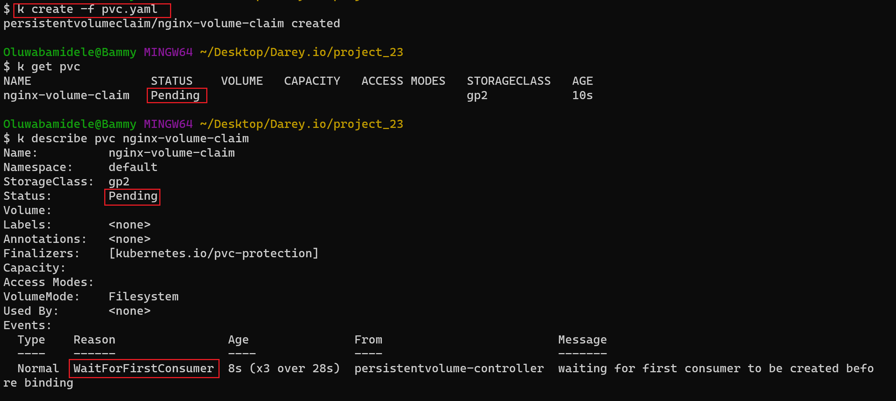
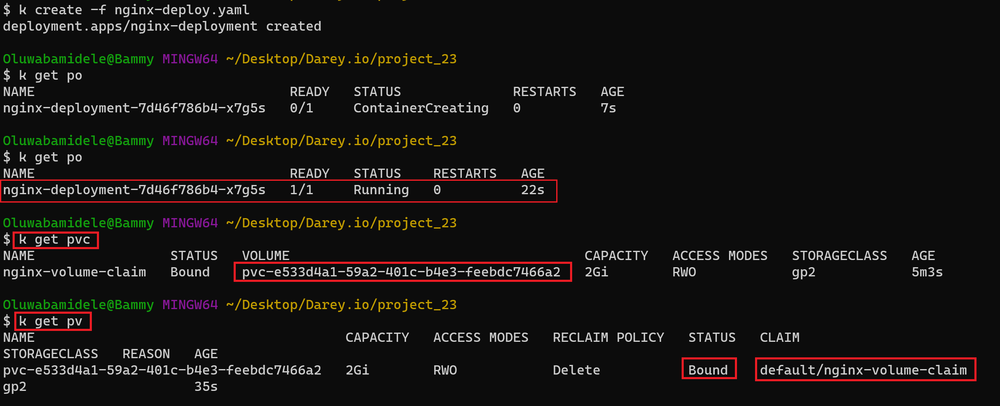
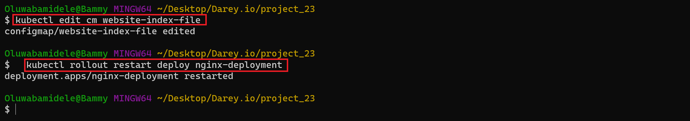

# Persisting Data in Kubernetes 

By the default the pods are ephemeral, meaning it can die at anytime and when it does, all information dies with the pod. 

## emptyDir

An emptyDir volume is first created when a Pod is assigned to a node, and exists as long as that Pod is running on that node. As the name says, the emptyDir volume is initially empty. All containers in the Pod can read and write the same files in the emptyDir volume, though that volume can be mounted at the same or different paths in each container. When a Pod is removed from a node for any reason, the data in the emptyDir is deleted permanently.

## Configure awsElasticBlockStore for Persisant Storage

An awsElasticBlockStore volume mounts an Amazon Web Services (AWS) EBS volume into your pod. The contents of an EBS volume are persisted and the volume is only unmmounted when the pod crashes, or terminates. This means that an EBS volume can be pre-populated with data, and that data can be shared between pods.

Before you create a persistant volume, lets run the nginx deployment into kubernetes without a volume.

Create a *nginx-deploy.yaml* file and run it on a k8s cluster.

```bash
apiVersion: apps/v1
kind: Deployment
metadata:
  name: nginx-deployment
  labels:
    tier: frontend
spec:
  replicas: 3
  selector:
    matchLabels:
      tier: frontend
  template:
    metadata:
      labels:
        tier: frontend
    spec:
      containers:
      - name: nginx
        image: nginx:latest
        ports:
        - containerPort: 80
```


Verify that the pod is running

```bash

# Note for short hand : alias k=kubectl
k get po
```


Check the logs of one the pod

```bash
k logs <nameofpod>
```


Exec into the pod and navigate to the nginx configuration file */etc/nginx/conf.d*. Open the config files to see the default configuration.


There are some restrictions when using an awsElasticBlockStore volume:

the nodes on which pods are running must be AWS EC2 instances
those instances need to be in the same region and availability zone as the EBS volume
EBS only supports a single EC2 instance mounting a volume

Now that the pods are running, as a requirement, you need to check the region and AZ where node it's running from.

```bash
# Get the node
k get po <podname> -o wide

# Get more information about the node
k describe node <nodename>
```


Create EBS volume with AWS CLI

```bash
# Make your AWS CLI is configured
aws ec2 create-volume --availability-zone=us-east-1a --size=12 --volume-type=gp2
```


Update the manifest file for the nginx depolyment with the volume ID and apply.

```bash

# Apply update
k apply -f <filename>

```

```bash

apiVersion: apps/v1
kind: Deployment
metadata:
  name: nginx-deployment
  labels:
    tier: frontend
spec:
  replicas: 1
  selector:
    matchLabels:
      tier: frontend
  template:
    metadata:
      labels:
        tier: frontend
    spec:
      containers:
      - name: nginx
        image: nginx:latest
        ports:
        - containerPort: 80
      volumes:
      - name: nginx-volume
        # This AWS EBS volume must already exist.
        awsElasticBlockStore:
          volumeID: "vol-0da4f68bb786e186e"
          fsType: ext4
```

Now, the new pod has a volume attached to it, and can be used to run a container for statefuleness. Run describe on the deployment.

```bash
#view pod information
k describe deploy
```


To complete the configuration, we will need to add another section to the deployment yaml manifest. The volumeMounts which basically answers the question "Where should this Volume be mounted inside the container?" Mounting a volume to a directory means that all data written to the directory will be stored on that volume.

Mount volume to directory by adding this section

```bash
        volumeMounts:
        - name: nginx-volume
          mountPath: /usr/share/nginx/
```


## Dynamically Persistent Volume (PV) and Persistent Volume Claim (PVC) on AWS EKS

Let's check the available classes.

```bash
k get storageclass
```


Create a manifest file pvc.yaml for a PVC, and based on the gp2 storageClass.

```bash
apiVersion: v1
kind: PersistentVolumeClaim
metadata:
  name: nginx-volume-claim
spec:
  accessModes:
  - ReadWriteOnce
  resources:
    requests:
      storage: 2Gi
  storageClassName: gp2
  ```

Apply the manifest file and view status

```bash
# Create PVC
k create -f pvc.yaml

# view the status of PVC
k get pvc

# Get more details about PVC
k describe pvc <pvcname>
```



To claim the volume, simply update the deployment manifest file volume section as seen the snippet below.

> *Note, starting from EKS 1.23, you are required to install an additional Amaon EBS driver before you can attach volumes to your pods. I have used EKS version 1.22 in this tutorial.*

```bash
apiVersion: apps/v1
kind: Deployment
metadata:
  name: nginx-deployment
  labels:
    tier: frontend
spec:
  replicas: 1
  selector:
    matchLabels:
      tier: frontend
  template:
    metadata:
      labels:
        tier: frontend
    spec:
      containers:
      - name: nginx
        image: nginx:latest
        ports:
        - containerPort: 80
        volumeMounts:
        - name: nginx-volume-claim
          mountPath: "/tmp/oayanda"
      volumes:
      - name: nginx-volume-claim
        persistentVolumeClaim:
          claimName: nginx-volume-claim
```

Verify the nginx pod is created with the volume created with the PVC.



View dynamically created volume in AWS console


Now the storage path "/tmp/oayanda" would persist across the pods in the deployment.

## configMaps

Using configMaps for persistence is not something you would consider for data storage. Rather it is a way to manage configuration files and ensure they are not lost as a result of Pod replacement.

- Remove the volumeMounts and PVC sections of the manifest and use kubectl to apply the configuration.
- port forward the service and ensure that you are able to see the "Welcome to nginx" page.
- exec into the running container and keep a copy of the index.html file somewhere. For example.

```bash
k exec -it <pod-name> bash
```


According to the official documentation of configMaps, A ConfigMap is an API object used to store non-confidential data in key-value pairs. Pods can consume ConfigMaps as environment variables, command-line arguments, or as configuration files in a volume.

Here, We will use configMap to create a file in a volume.

create and apply the configMap manifest file 

```bash
cat <<EOF | tee ./nginx-configmap.yaml
apiVersion: v1
kind: ConfigMap
metadata:
  name: website-index-file
data:
  # file to be mounted inside a volume
  index-file: |
    <!DOCTYPE html>
    <html>
    <head>
    <title>Welcome to nginx!</title>
    <style>
    html { color-scheme: light dark; }
    body { width: 35em; margin: 0 auto;
    font-family: Tahoma, Verdana, Arial, sans-serif; }
    </style>
    </head>
    <body>
    <h1>Welcome to nginx!</h1>
    <p>If you see this page, the nginx web server is successfully installed and
    working. Further configuration is required.</p>

    <p>For online documentation and support please refer to
    <a href="http://nginx.org/">nginx.org</a>.<br/>
    Commercial support is available at
    <a href="http://nginx.com/">nginx.com</a>.</p>

    <p><em>Thank you for using nginx.</em></p>
    </body>
    </html>
EOF
```

Update the deployment file to use the configmap in the volumeMounts section

```bash
cat <<EOF | tee ./nginx-deploy.yaml
apiVersion: apps/v1
kind: Deployment
metadata:
  name: nginx-deployment
  labels:
    tier: frontend
spec:
  replicas: 1
  selector:
    matchLabels:
      tier: frontend
  template:
    metadata:
      labels:
        tier: frontend
    spec:
      containers:
      - name: nginx
        image: nginx:latest
        ports:
        - containerPort: 80
        volumeMounts:
          - name: config
            mountPath: /usr/share/nginx/html
            readOnly: true
      volumes:
      - name: config
        configMap:
          name: website-index-file
          items:
          - key: index-file
            path: index.html
EOF
```

Now the index.html file is no longer ephemeral because it is using a configMap that has been mounted onto the filesystem. This is now evident when you exec into the pod and list the /usr/share/nginx/html directory.


Edit the config manifest file and updete deployment pod

View in browser

```bash
k port-forward deployment.apps/nginx-deployment 8090:80
```


